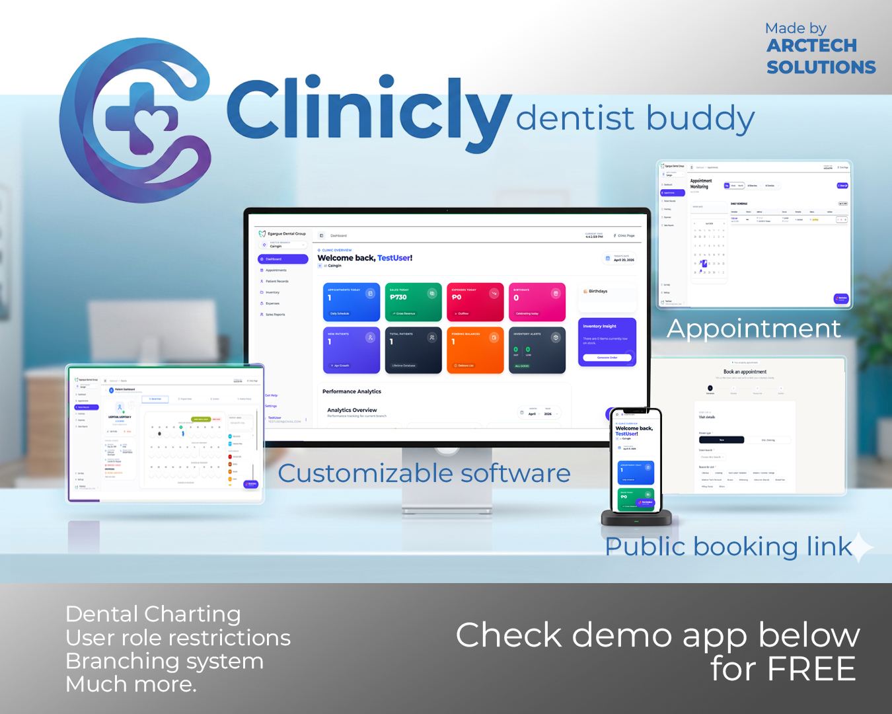
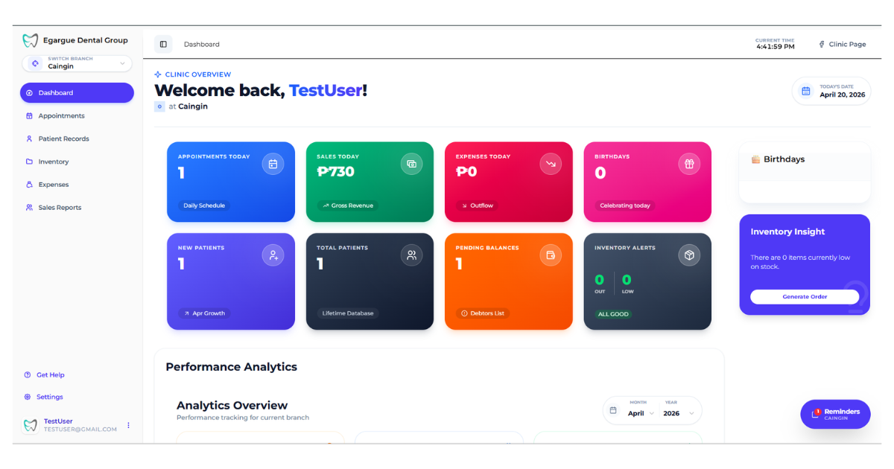
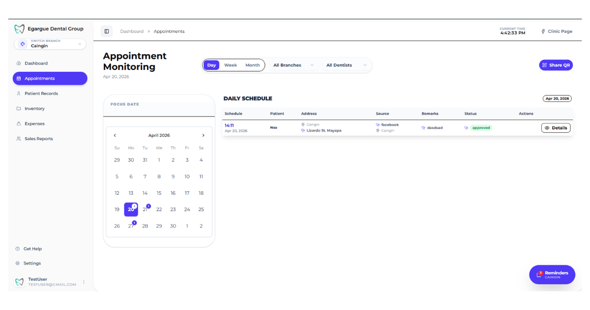
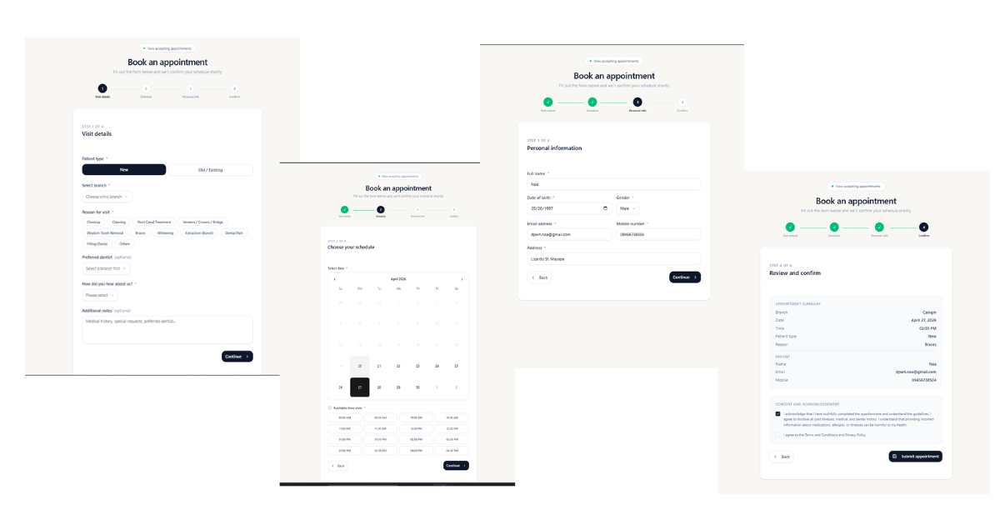
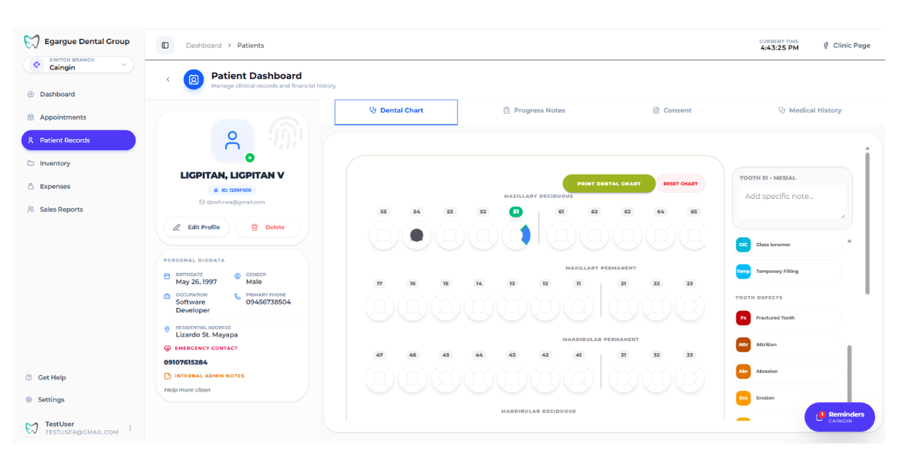

# 🦷 Clinicly V4 — Dental Clinic Management System

> A complete, production-ready dental clinic management system built specifically for Filipino dental clinics. Built by [ArcTech Solutions](https://web.facebook.com/ArcTechSolutions25).



[](https://clinicly-v4.vercel.app)
[](https://nextjs.org)
[](https://appwrite.io)
[](https://vercel.com)

---

## 📋 Table of Contents

- [Overview](#overview)
- [Live Demo](#live-demo)
- [Features](#features)
- [Tech Stack](#tech-stack)
- [Screenshots](#screenshots)
- [Getting Started](#getting-started)
- [Environment Variables](#environment-variables)
- [Project Structure](#project-structure)
- [Roadmap](#roadmap)
- [About the Developer](#about-the-developer)

---

## 🧩 Overview

Clinicly V4 is a full-featured dental clinic management system designed to replace manual paper-based workflows in Philippine dental clinics. It handles everything from patient records and appointment booking to inventory management, sales tracking, and multi-branch monitoring — all in one platform.

**The problem it solves:**
Most dental clinics in the Philippines still manage patient records in folders, appointments through Facebook comments, and revenue tracking on a calculator. Clinicly digitizes all of that — affordably and locally supported.

**Currently serving real dental clinic clients across the Philippines.**

---

## 🚀 Live Demo

| Resource | Link |
|---|---|
| Live App | [clinicly-v4.vercel.app](https://clinicly-v4.vercel.app) |
| Demo Login | testuser@gmail.com / testpassword |
| Public Booking Page | [clinicly-v4-appointment.vercel.app](https://clinicly-v4-appointment.vercel.app) |
| Facebook Page | [ArcTech Solutions](https://web.facebook.com/ArcTechSolutions25) |

---

## ✨ Features

### 🏥 Core Management
- **Patient Records** — Complete digital patient history, contact info, address, and dental notes
- **Patient Search** — Instant search across all patient records
- **Pending Balances** — Track patients with outstanding balances and generate debtor lists

### 📅 Appointments
- **Appointment Monitoring** — Day, Week, and Month calendar views
- **Multi-dentist filtering** — Filter appointments by dentist
- **Status tracking** — Pending, Confirmed, Attended, Cancelled
- **QR Code Booking** — Shareable QR code for patient self-booking
- **Public Booking Page** — Patients can book appointments online without an account

### 💰 Sales & Finance
- **Transaction Recording** — Log every patient transaction
- **Sales Reports** — Daily, monthly, and yearly revenue analytics
- **Expenses Tracking** — Monitor clinic outflows
- **Revenue Dashboard** — Real-time gross revenue display

### 📦 Inventory
- **Inventory Masterlist** — Track all clinic supplies and materials
- **Low Stock Alerts** — Get notified when items are running low
- **Out of Stock Alerts** — Immediate visibility on depleted items
- **Generate Order** — Quick reorder workflow

### 🏢 Multi-Branch
- **Branch Switching** — Instantly switch between branches
- **Per-branch data** — Each branch has separate records, appointments, and analytics
- **Branch performance comparison** — Compare metrics across locations

### 📊 Analytics & Insights
- **Performance Analytics** — Monthly and yearly charts
- **New patient growth** — Track patient acquisition over time
- **Birthday reminders** — Never miss a patient's birthday
- **Inventory insights** — Stock health at a glance

### 🔐 Access Control
- **Role-based access** — Admin and staff roles with different permissions
- **Branch-level access** — Staff only see their assigned branch
- **Secure authentication** — Powered by Appwrite Auth

---

## 🛠 Tech Stack

| Category | Technology |
|---|---|
| Frontend | NextJS 14, React, TypeScript |
| UI Components | Shadcn UI, Tailwind CSS |
| Backend / BaaS | Appwrite (Database, Auth, Storage) |
| Deployment | Vercel (Frontend), Hetzner VPS (Appwrite self-hosted) |
| State Management | Zustand |
| Date handling | date-fns |
| Notifications | Sonner |
| Icons | Lucide React |

---

## 📸 Screenshots

### Dashboard

> Real-time overview of appointments, sales, expenses, patients, inventory, and birthdays.

### Appointment Calendar

> Full calendar view with day/week/month toggle, dentist filtering, and QR sharing.

### Public Booking Form

> Patient-facing booking form with branch selection, time slots, and consent management.

### Patient Records

> Complete digital patient directory with search and balance tracking.

---

## 🏁 Getting Started

### Prerequisites

- Node.js 18+
- npm or yarn
- Appwrite instance (self-hosted or cloud)

### Installation

```bash
# Clone the repository
git clone https://github.com/Noah202226/clinicly-v4.git

# Navigate to project directory
cd clinicly-v4

# Install dependencies
npm install

# Copy environment variables
cp .env.example .env.local

# Start development server
npm run dev
```

Open [http://localhost:3000](http://localhost:3000) to view the app.

---

## 🔐 Environment Variables

Create a `.env.local` file in the root directory with the following:

```env
# Appwrite Configuration
NEXT_PUBLIC_APPWRITE_ENDPOINT=https://your-appwrite-endpoint
NEXT_PUBLIC_PROJECT_ID=your-project-id
NEXT_PUBLIC_DATABASE_ID=your-database-id

# Collection IDs
NEXT_PUBLIC_PATIENTS_COLLECTION_ID=patients
NEXT_PUBLIC_APPOINTMENTS_COLLECTION_ID=appointments
NEXT_PUBLIC_BRANCHES_COLLECTION_ID=branches
NEXT_PUBLIC_DENTISTS_COLLECTION_ID=dentists
NEXT_PUBLIC_CLINIC_HOURS_COLLECTION_ID=clinichours
NEXT_PUBLIC_TRANSACTIONS_COLLECTION_ID=transactions
NEXT_PUBLIC_EXPENSES_COLLECTION_ID=expenses
NEXT_PUBLIC_INVENTORIES_COLLECTION_ID=inventories
```

> ⚠️ Never commit your `.env.local` file. It is already included in `.gitignore`.

---

## 📁 Project Structure

```
clinicly-v4/
├── app/
│   ├── (auth)/
│   │   └── login/
│   ├── dashboard/
│   │   ├── appointments/
│   │   ├── patients/
│   │   ├── inventory/
│   │   ├── expenses/
│   │   └── sales-reports/
│   └── store/              # Zustand stores
├── components/
│   ├── ui/                 # Shadcn UI components
│   └── [feature components]
├── lib/
│   ├── appwrite.ts         # Appwrite client config
│   └── utils.ts
├── public/
│   └── screenshots/
└── .env.example
```

---

## 🗺 Roadmap

- [x] Patient records management
- [x] Appointment booking system
- [x] Public QR booking page
- [x] Multi-branch support
- [x] Sales & transaction tracking
- [x] Inventory management
- [x] Role-based access control
- [x] Performance analytics
- [ ] SMS appointment reminders
- [ ] Patient mobile app
- [ ] Insurance/HMO tracking
- [ ] Dental chart (tooth diagram)
- [ ] Treatment plans
- [ ] AI-powered insights

---

## 👨‍💻 About the Developer

**Noa V. Ligpitan** — Founder of ArcTech Solutions

Full Stack Developer specializing in React, NextJS, and business management systems for Philippine SMEs.

| Platform | Link |
|---|---|
| GitHub | [github.com/Noah202226](https://github.com/Noah202226) |
| LinkedIn | [linkedin.com/in/noaligpitan26](https://linkedin.com/in/noaligpitan26) |
| Portfolio | [noaligpitan.site](https://noaligpitan.site) |
| Facebook | [ArcTech Solutions](https://web.facebook.com/ArcTechSolutions25) |
| YouTube | [@devBrosPh](https://youtube.com/@devBrosPh) |

---

## 📄 License

This project is proprietary software owned by ArcTech Solutions.
For licensing inquiries, contact: arctech26.business@gmail.com

---

<div align="center">
  <p>Built with ❤️ for Filipino dental clinics</p>
  <p>by <strong>ArcTech Solutions</strong></p>
</div>
